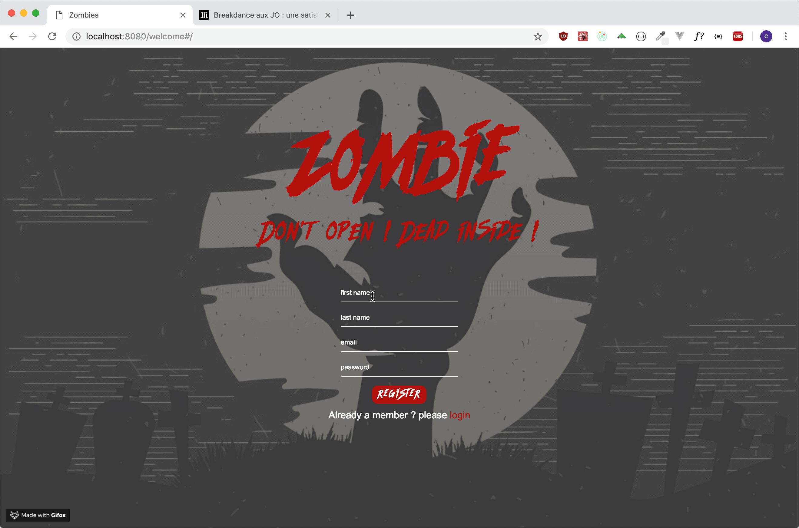
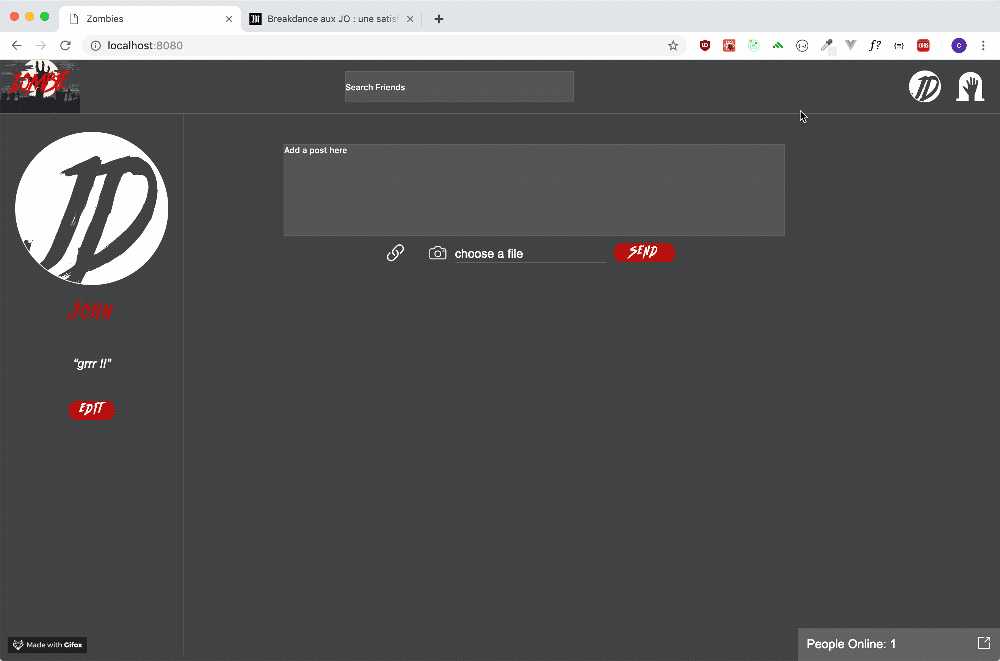
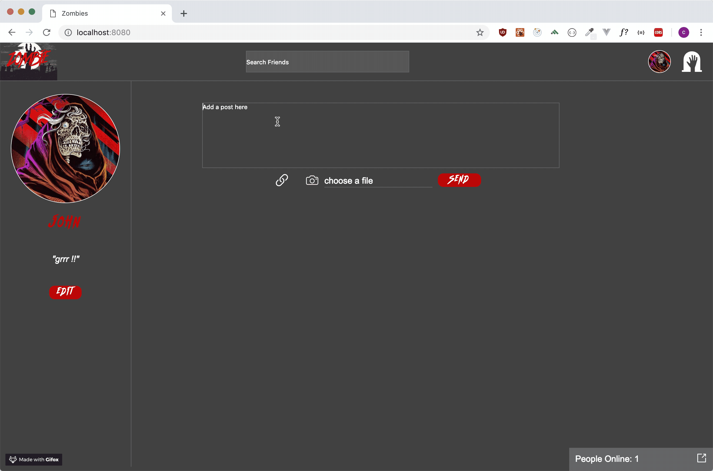
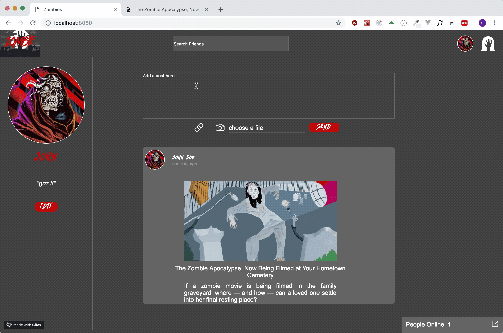
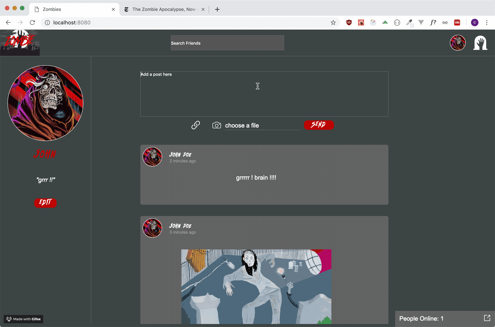
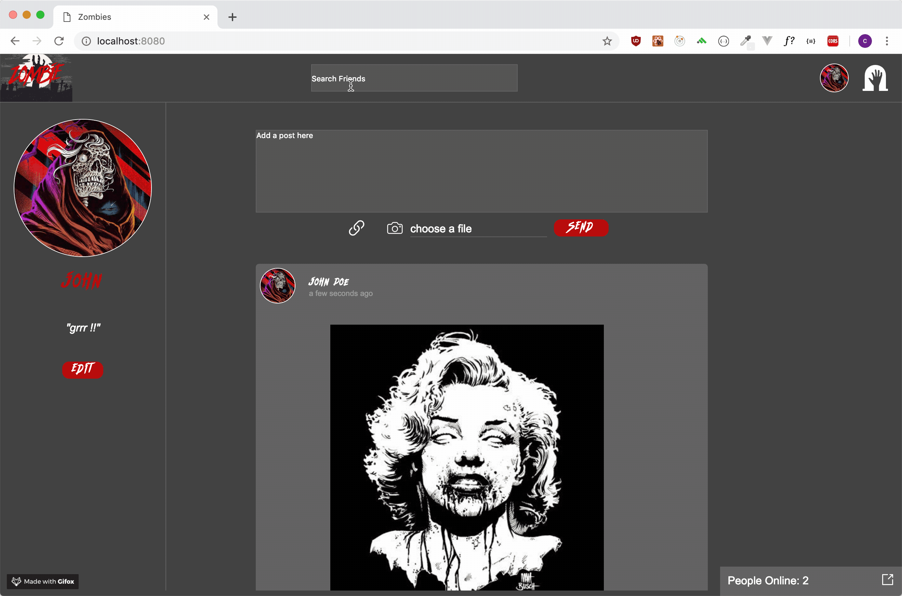
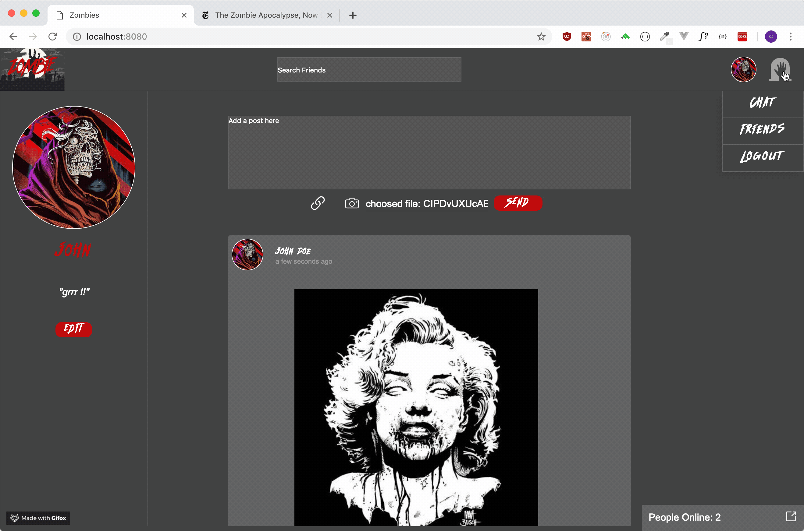

# Social Network

This a first experience creating a facebook kind of website. I made a social network for zombies, I'm sure this people really need and want to communicate...
There is different feature from a social network, like request friendship, ending friendship, refusing friendship etc... a chat page, a wall where you can post comments, pictures or link.



## Getting Started

You'll have first to register or login yourself on the website, there is normal error handling, every input are needed, email should be a real one, password should be at least 8 character, including at least one number, one uppercase letter and no space.
Once on your page you ll be able to add a profile picture, if not your initial will be used in place.



With that in place, you'll already be able to post new comments on the wall, just choose if you want to send a 'normal' comment or share a link with the community, by clicking the correspondant icon.




and add picture from your computer



Now you can start creating your own community of zombies by first searching who's register on the website using the searchbar.
Then you can navigate to there page, seeing there own publication, if they already made some, and ask their friendship.



You can then navigate to the chat using the menu on the top right of the window, and start chatting with your online friends. You will be able to see who's online by clicking and opening the window "people online:" situated on the bottom right of the page.



You can also navigate to your friends managing page by clicking 'friends' in the menu, you'll be redirected to a page where you can see all your friend and all the friend request you received and manage the status of each one.


### Installing

to install the application on your local machine simply clone the repository to your local machine. 
create a new database and use the files from the SQL folder to create the tables.
Go to the root of your folder

```
npm install
```

open a new tab in your terminal 

```
node bundle.server.js
```

then to start the server

```
npm start
```

## Built With

* Node.js
* Express
* socketIO
* multer
* knox
* JavaScript
* PostgreSQL
* CSS
* HTML


## Authors

* **Christophe Johanny** - *Initial work* - [st-jon](https://github.com/st-jon)


## License

This project is licensed under the MIT License - see the [LICENSE.md](LICENSE.md) file for details


